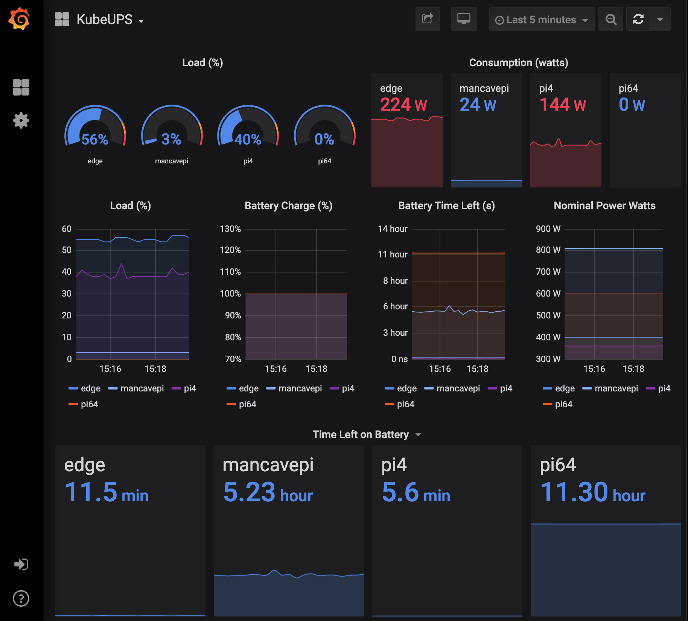

####
`kubeUPS` is a easy-to-install helm chart that allows you to monitor UPS (battery-backup) devices plugged-into your kubernetes clusters. Multi-architecture compliant `amd64`,`arm`, `aarch64` or a mixture of all of them combined.



## What's this for? 💻
This collection of Docker images deploys a full monitoring stack needed to get you counting those watts with a fine-tooth comb. 


## Prerequesites
 * a Kubernetes cluster. I recommend [k3s](https://k3s.io) with USB-based UPS devices plugged in to nodes.
 * nodes labeled with `has_ups=true`
 * a valid [helm](https://helm.sh) installation

## Installation (tldr)
```bash
    # label nodes with UPS Devices
    kubectl label node node1 has_ups=true

    # install helm chart   
    git clone https://github.com/bgulla/kubeups.git
    cd kubeups
    helm install kubeups chart/kubeups --debug
    echo "profit!"
```
## Chart Values

| Key | Type | Default | Description |
|-----|------|---------|-------------|
| affinity | object | `{}` |  |
| apcupsd.image.repository | string | `"bgulla/apcupsd"` |  |
| grafana.image.name | string | `"grafana/grafana:latest"` |  |
| grafana.nodePort | int | `30075` |  |
| image.pullPolicy | string | `"IfNotPresent"` |  |
| image.repository | string | `"bgulla/apcupsd"` |  |
| ingress.annotations | object | `{}` |  |
| ingress.enabled | bool | `false` |  |
| ingress.hosts[0].host | string | `"chart-example.local"` |  |
| ingress.hosts[0].paths | list | `[]` |  |
| ingress.tls | list | `[]` |  |
| mqtt.apcupsd_host | string | `"127.0.0.1"` |  |
| mqtt.enabled | bool | `false` |  |
| mqtt.host | string | `"kubeups.mqtt.svc"` |  |
| mqtt.image.name | string | `"bgulla/apcupsd-mqtt"` |  |
| mqtt.image.pullPolicy | string | `"Always"` |  |
| mqtt.name | string | `"mqttexporter"` |  |
| mqtt.password | string | `nil` |  |
| mqtt.port | int | `1883` |  |
| mqtt.user | string | `nil` |  |
| name | string | `"kubeups"` |  |
| namespace | string | `"kubeups"` |  |
| nodeSelector | object | `{}` |  |
| persistence.accessMode | string | `"ReadWriteOnce"` |  |
| persistence.enabled | bool | `false` |  |
| persistence.size | string | `"8Gi"` |  |
| prometheus.image.name | string | `"prom/prometheus:latest"` |  |
| prometheus.nodePort | int | `30069` |  |
| prometheus_exporter.image.name | string | `"bgulla/apcupsd_exporter"` |  |
| prometheus_exporter.image.pullPolicy | string | `"Always"` |  |
| resources | object | `{}` |  |
| service.port | int | `80` |  |
| service.type | string | `"ClusterIP"` |  |
| serviceAccount.create | bool | `true` |  |
| serviceAccount.name | string | `"prometheus"` |  |
| tolerations | list | `[]` |  |


## TODO
* deploy a smtp-forwarder for email alerts (moderate time dedication)

